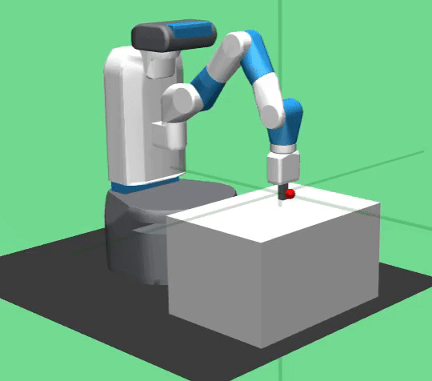

# Trajectory Planning using HER & Reward Engineering

Trajectory planning based on Reinforcement Learning with Hindsight Experience Replay & Dense Reward Engineering to solve openai-gym robotics "FetchReach-v1" environment using TF2.

## Reinforcement Learning Algorithms

1. Dense Reward Engineering: Engineered vector based distance measure to replace sparse rewards.

2. Hindsight Experience Relay (HER): Implemented HER Future Strategy based goal sampling for buffer augmentation.

## Training Profile

|HER Training|Dense Reward Engg. Training|
|:--:|:--:|
|||
|||

## Testing Profile


## Dependencies

Install dependencies using:

```bash
pip3 install -r requirements.txt 
```

1. Additionally install 'mujoco_py' according to 'https://github.com/openai/mujoco-py'

## Observations

1. Final position of 'HER' & 'Reward Engineering' is kinda shaky!
2. HER based TD3 Agent Mean Test Score: -1.66
3. RE based TD3 Agent Mean Test Score: -1.69
4. Test Performance Ratio (HER Agent | RE Agent)=(0.98 | 1)

## Developer

* Name: Kanishk Navale
* Email: navalekanishk@gmail.com
* Website: https://kanishknavale.github.io/
