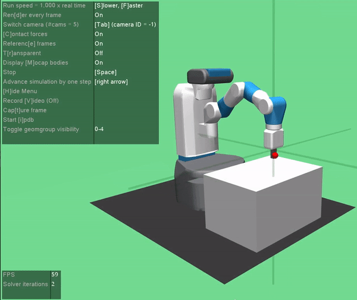

# Trajectory Planning using HER & Reward Engineering
Trajectory planning based on Reinforcement Learning with Hindsight Experience Replay and Dense Reward Engineering to solve openai-gym robotics "FetchReach-v1" environment using TensorFlow.

## Reinforcement Learning Algorithms,
1. Dense Reward Engineering <br />
    Augmented the sparse reward into dense rewards. Used the initial EOAT position to map the distance with Target position. As the distance reduces the reward increases. Rescaled the reward into a range of [-1,1].

2. Hindsight Experience Relay (HER) <br />
    Tricked the environment that it reached the goal. 

3. HER + Dense Reward Engineering <br />
    Combination of (1) and (2)

## Training History,
* Measure: Accumulated Rewards over Episodes
1. Dense Reward Engineering,
    <p ></p>

2. HER,
    <p ></p>

3. HER + Dense Reward Engineering,
    <p ></p>

## Dependencies,
Install dependencies using:
```bash
pip3 install -r requirements.txt 
```
1. Additionally install 'mujoco_py' according to 'https://github.com/openai/mujoco-py'

## Observations,
1. Final position of 'HER' & 'Reward Engineering' is jittering.
2. 'HER + Reward Engineering' is less jittery but has a offset in final position.

* Preview of Reward Engineering,
    <p ></p>

## Contact
* email: navalekanishk@gmail.com